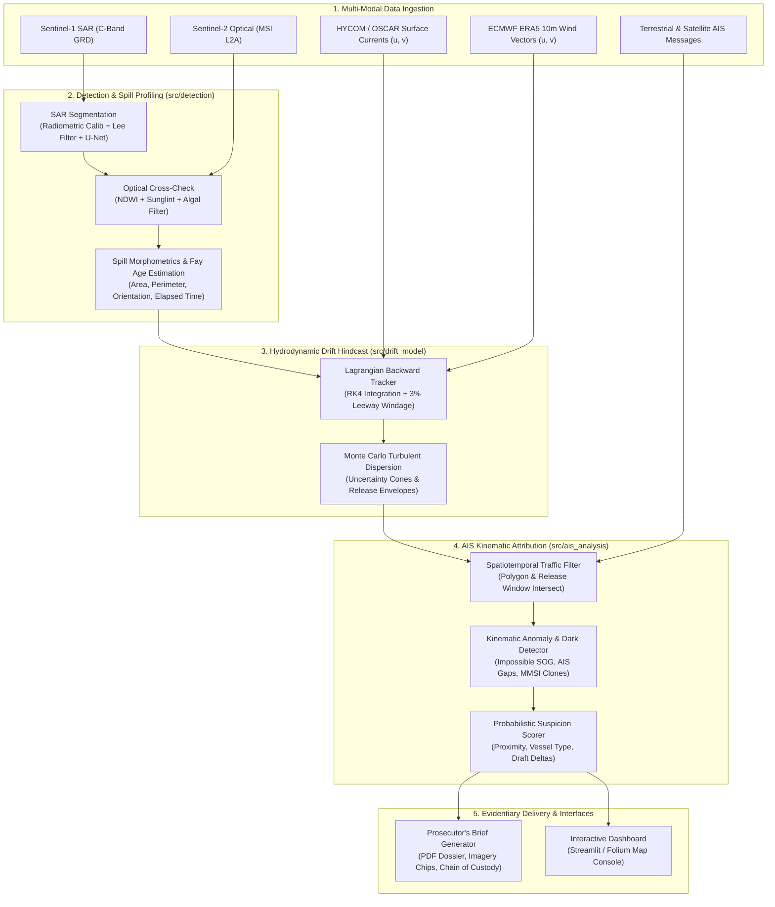

# Maritime Oil Spill Detection and Vessel Attribution Architecture

## 1. System Overview

The **Oil Spill Attribution System** is an end-to-end multi-sensor intelligence platform designed to detect illicit maritime hydrocarbon discharges, model their hydrodynamic drift back to origin, identify suspect vessels from AIS traffic, and produce legally admissible evidence dossiers.

---

## 2. Component Breakdown

### A. Detection Engine (`src/detection/`)
- **`sar_segmentation.py`**: Ingests Sentinel-1 Level-1 GRD imagery in VV and VH polarizations. Performs radiometric calibration to $\sigma_0$ (dB), reduces speckle via Lee/Frost adaptive filtering, and executes deep neural network inference (U-Net or ONNX runtime) to segment dark ocean surface patches caused by capillary wave damping.
- **`optical_fusion.py`**: Intersects SAR candidates with co-registered Sentinel-2 multi-spectral bands. Computes Normalized Difference Water Index (NDWI) and checks for elevated chlorophyll-a (algal bloom) or sunglint artifacts to eliminate false positives.
- **`spill_properties.py`**: Extracts slick polygon metrics (surface area in $km^2$, major/minor elongation axes, perimeter) and applies the Fay three-phase spreading model to estimate slick age $t_{spill}$.

### B. Hydrodynamic Drift Model (`src/drift_model/`)
- **`lagrangian_tracker.py`**: Solves the Lagrangian particle transport equations backwards in time (hindcasting) from detection timestamp $t_{det}$ to $t_{det} - \Delta t_{lookback}$. Uses 4th-order Runge-Kutta (RK4) integration:
  $$\vec{x}(t - \Delta t) = \vec{x}(t) - \int_{t-\Delta t}^t (\vec{u}_{current} + \alpha_{leeway} \mathbf{R}(\theta) \vec{u}_{wind}) \, dt$$
- **`uncertainty.py`**: Injects stochastic Gaussian turbulence ($\sqrt{2 K_h \Delta t}$) across an ensemble of $N$ particles to generate dynamic 95% confidence release envelopes (convex hulls / alpha shapes).

### C. AIS Attribution Engine (`src/ais_analysis/`)
- **`traffic_filter.py`**: Performs spatiotemporal intersection between the hindcasted uncertainty envelope and historical AIS trajectory broadcasts.
- **`spoofing_detector.py`**: Validates kinematic plausibility: identifies impossible velocity jumps ($> 40\text{ knots}$ for commercial tankers), duplicate MMSIs simultaneously broadcasting from distant locations, and deliberate transponder dark periods.
- **`suspicion_scorer.py`**: Combines spatial distance to release origin, temporal coincidence, vessel class risk factors (e.g. crude carrier vs bulk carrier), draft reductions (cargo discharge indicators), and AIS blackout flags into a normalized index $S \in [0.0, 1.0]$.

### D. Legal Evidentiary Reporting (`src/reporting/`)
- **`generate_report.py`**: Compiles an automated "Prosecutor's Evidentiary Brief" formatted as a secure PDF dossier. Embeds georeferenced satellite chips, backward drift path overlays, suspect vessel profiles, and SHA-256 digital hashes for chain-of-custody preservation under MARPOL Annex I.

### E. Analytical Dashboard (`dashboard/`)
- **`app.py`**: Multi-page interactive console built with Streamlit and Folium, offering map-based inspection, dynamic slider adjustments for leeway windage, interactive vessel trajectory inspection, and one-click PDF generation.
